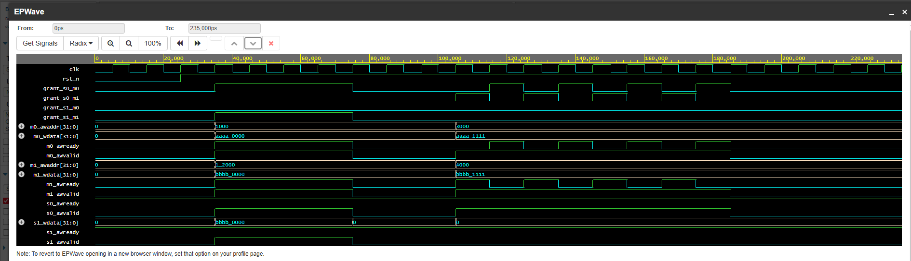

# AXI-Crossbar-2x2
from 2 masters → 1 slave, improve to 2 masters → 2 slaves

## Only WRITE
#Master 0 and Master 1 can access Slave 0 or Slave 1.
#Address decoding is used to select a slave.
#Arbitration is performed when two masters simultaneously request access to the same slave.
#Parallel operation is supported:
M0 → S0
M1 → S1

